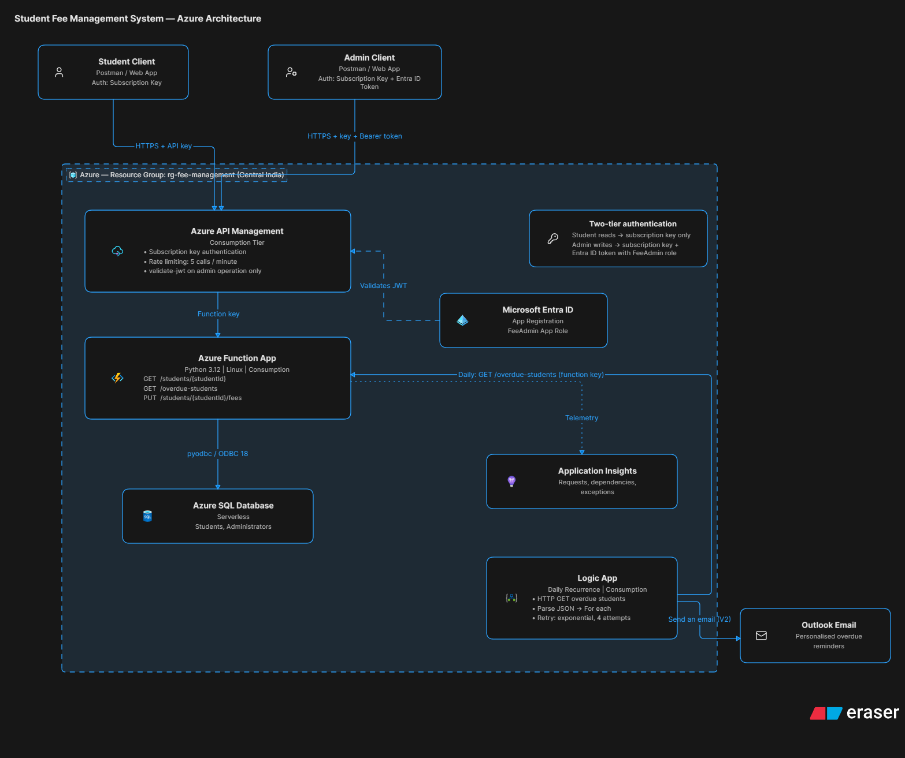

# Azure Fee Management System

A cloud-native student fee management system built on Microsoft Azure. It stores
fee records, exposes a secured API for querying and updating them, and sends
automated reminders for overdue payments.



---

## Contents

- [Architecture](#architecture)
- [Repository structure](#repository-structure)
- [Azure resources](#azure-resources)
- [Deployment guide](#deployment-guide)
- [API reference](#api-reference)
- [Design decisions](#design-decisions)
- [Assumptions](#assumptions)

---

## Architecture

```
  Student client                    Admin client
  (subscription key)                (subscription key + Entra ID token)
        |                                 |
        +----------------+----------------+
                         |
                         v
              Azure API Management  (Consumption)
              - subscription keys
              - rate limiting (5 calls / minute)
              - validate-jwt on the admin operation
                         |
                         v
              Azure Function App  (Python 3.12, Linux Consumption)
              GET  /students/{studentId}
              GET  /overdue-students
              PUT  /students/{studentId}/fees
                    |                    |
                    v                    v
          Azure SQL Database      Application Insights
          Students, Administrators

          Logic App (daily recurrence)
          -> HTTP GET /overdue-students
          -> Parse JSON
          -> For each -> Send email
          -> exponential retry, 4 attempts
                    |
                    v
             Outlook email reminders
```

Two flows exist in the system:

**Synchronous** — a client calls the API through API Management, which
authenticates the request, applies rate limiting, and forwards to the Function
App. The function reads or writes Azure SQL and returns JSON.

**Asynchronous** — a Logic App runs daily, calls the overdue endpoint, and sends
a personalised reminder email for each overdue student.

---

## Repository structure

```
fee-management-system/
├── sql/
│   ├── 01_schema.sql          Tables and index (run once)
│   └── 02_seed.sql            25 students, 3 administrators (re-runnable)
├── functions/
│   ├── function_app.py        Three HTTP endpoints
│   ├── requirements.txt
│   ├── host.json
│   ├── local.settings.json.example
│   └── requests.http          Local test requests
├── policies/
│   ├── api-level-policy.xml   Rate limiting, applied to all operations
│   └── admin-operation-policy.xml   JWT validation, PUT operation only
└── README.md
```

---

## Azure resources

All resources are in the resource group `rg-fee-management`, region Central India.

| Resource | Type | Tier |
|---|---|---|
| `fee-management-dhiren-2026` | SQL Server | — |
| `FeeManagementDB` | SQL Database | General Purpose Serverless (free offer) |
| `fee-management-api-dhiren` | Function App | Consumption, Linux, Python 3.12 |
| `feemanagementapidhiren` | Application Insights | Free ingestion allowance |
| `apim-fee-management-dhiren` | API Management | Consumption |
| `logic-fee-reminders` | Logic App | Consumption |
| `fee-management-admin-api` | Entra ID app registration | Free |

Consumption and serverless tiers were chosen throughout: the workload is
event-driven and intermittent, so paying per execution is both cheaper and a
better fit than reserving capacity.

---

## Deployment guide

### Prerequisites

- Azure subscription
- Python 3.12
- Azure Functions Core Tools v4
- ODBC Driver 18 for SQL Server
- VS Code with the Azure Functions extension

### Step 1 — Azure SQL Database

1. Create a SQL Database named `FeeManagementDB` on a new logical server.
   Choose **General Purpose → Serverless** and apply the free offer if available.
2. On the server's **Networking** page:
   - Set **Allow Azure services and resources to access this server** to Yes.
     This is what permits the Function App to reach the database.
   - Add your client IP address to the firewall rules.
3. Open **Query editor**, sign in with the SQL admin credentials, and run
   `sql/01_schema.sql`.
4. Clear the editor and run `sql/02_seed.sql`. The final query returns a
   breakdown confirming all three payment statuses are present in the seed data.

### Step 2 — Function App

1. In VS Code, run **Azure Functions: Create Function App in Azure (Advanced)**:
   - Runtime: Python 3.12
   - OS: Linux
   - Hosting plan: Consumption
   - Application Insights: **create new** — this satisfies the monitoring
     requirement at provisioning time
2. In the Function App's **Environment variables**, add an application setting:
   - Name: `SqlConnectionString`
   - Value: the ODBC connection string from the database's **Connection strings**
     page, with the password substituted
3. Deploy: right-click the Function App in the VS Code Azure panel →
   **Deploy to Function App**

Add the connection string before deploying, otherwise the first invocation fails
reading `os.environ["SqlConnectionString"]`.

### Step 3 — API Management

1. Create an API Management instance on the **Consumption** tier.
2. **APIs → Add API → Function App**, browse to the Function App and import all
   three functions.
3. Correct the imported operations, which default to POST:

   | Operation | Method | URL template |
   |---|---|---|
   | `get_student_fee` | GET | `/students/{studentId}` |
   | `get_overdue_students` | GET | `/overdue-students` |
   | `update_student_fees` | PUT | `/students/{studentId}/fees` |

4. Apply `policies/api-level-policy.xml` at the **All operations** scope. This
   adds the rate limit.
5. Create a **Product**, tick **Requires subscription**, and add the API to it.
   This is what enforces the subscription key.
6. Copy the primary key from **Subscriptions** — clients send it as
   `Ocp-Apim-Subscription-Key`.

### Step 4 — Entra ID and RBAC

1. **Entra ID → App registrations → New registration**, single tenant.
2. **Expose an API** → set the Application ID URI to the default
   `api://<client-id>`.
3. **App roles** → create a role:
   - Value: `FeeAdmin`
   - Allowed member types: **Applications**
4. **Certificates & secrets** → create a client secret and record its value.
5. **API permissions** → add the `FeeAdmin` application permission for this app,
   then **Grant admin consent**. Without this the token is issued but carries no
   role claim.
6. Apply `policies/admin-operation-policy.xml` to the `update_student_fees`
   operation only, substituting your tenant and client IDs.

Obtain a token with the client credentials flow:

```powershell
$body = @{
    client_id     = "<client-id>"
    client_secret = "<client-secret>"
    scope         = "api://<client-id>/.default"
    grant_type    = "client_credentials"
}
$r = Invoke-RestMethod -Method Post `
    -Uri "https://login.microsoftonline.com/<tenant-id>/oauth2/v2.0/token" `
    -Body $body
$r.access_token | Set-Clipboard
```

Send it as `Authorization: Bearer <token>`.

### Step 5 — Logic App

1. Create a Logic App on the **Consumption** plan.
2. Build the workflow:
   - **Recurrence** — interval 1, frequency Day
   - **HTTP** — GET the `/api/overdue-students` function URL including its
     function key
   - **Parse JSON** — content is the HTTP body; generate the schema from a
     sample payload
   - **For each** — iterate the parsed body
   - **Send an email (V2)** — inside the loop, with student fields bound from
     the parsed JSON
3. On both the HTTP and email actions, open **Settings → Retry Policy** and set:
   - Type: Exponential Interval
   - Count: 4
   - Interval: PT7S

---

## API reference

Base URL: `https://<apim-name>.azure-api.net/<api-suffix>`

All requests require `Ocp-Apim-Subscription-Key`.

### GET /students/{studentId}

Returns fee details and the calculated payment status.

```json
{
  "studentId": 1,
  "name": "Aarav Sharma",
  "course": "Computer Engineering",
  "totalFee": 120000.0,
  "paidAmount": 120000.0,
  "balance": 0.0,
  "dueDate": "2026-07-01",
  "paymentStatus": "Paid"
}
```

Returns 404 if the student does not exist.

### GET /overdue-students

Returns an array of students whose balance is outstanding and whose due date has
passed. Consumed by the Logic App.

### PUT /students/{studentId}/fees

Updates a fee record. Requires an Entra ID bearer token carrying the `FeeAdmin`
role, in addition to the subscription key. Also requires
`Content-Type: application/json`.

```json
{ "paidAmount": 95000 }
```

Any combination of `totalFee`, `paidAmount` and `dueDate` may be supplied;
omitted fields keep their existing values. Returns 400 if none are supplied,
401 without a valid admin token, and 404 if the student does not exist.

---

## Design decisions

**Logic App rather than a Durable Function.** The reminder workflow is a daily
scheduled fan-out with no complex state. Logic Apps provide the scheduler,
retry policy and email connector as configuration rather than code, and the run
history is directly inspectable. A Durable Function would be the better choice
if the orchestration required stateful coordination or compensation logic.

**Payment status is calculated in the Function, not the database.** The brief
specifies using Azure Functions for fee calculations. Keeping the rule in one
Python function means the API and the Logic App can never disagree about a
student's status.

**Status precedence.** The three statuses are not mutually exclusive, so the
order of evaluation matters:

```
PaidAmount >= TotalFee   -> Paid
DueDate < today          -> Overdue
otherwise                -> Partially Paid
```

A fully paid student is never reported as overdue, even past the due date.

**Two-tier authentication.** Student read operations require a subscription key.
The admin write operation requires a subscription key *and* an Entra ID token
carrying the `FeeAdmin` role. Both are enforced at the API Management edge, so
an unauthorised request never reaches the Function App.

**Function-level authorisation on the backend.** All three functions use
`AuthLevel.FUNCTION`, so the Function App cannot be called without a function
key. API Management holds that key, which makes it the only public entry point.

**No hardcoded secrets.** The SQL connection string is read from an application
setting via `os.environ`, set separately in each environment.

**Parameterised SQL throughout.** The update endpoint uses `COALESCE` on each
column rather than building a dynamic SET clause, so partial updates need no
string concatenation and every value is passed as a parameter.

**Indexing for scale.** The clustered primary key on `StudentID` serves the
single-student lookup. A non-clustered index on `DueDate` supports the overdue
scan, which is the only other query pattern in the system. Both remain efficient
as the table grows toward the 5000-record requirement.

---

## Assumptions

**Email recipient.** The `Students` schema specified in the brief contains no
email column. Rather than deviate from the specified columns, reminder emails
are sent to a single configured mailbox, personalised with each student's
details. In production an `Email` column would be added to `Students` and bound
to the connector's recipient field.

**Fourth status case.** A student who has paid nothing and whose due date has not
yet passed does not fit cleanly into any of the three statuses the brief allows.
The implementation returns "Partially Paid" as the fall-through. A production
system would add a distinct "Pending" status.

**Administrators table.** The brief specifies this table but does not define its
relationship to `Students`, and no join column exists in either schema. Entra ID
is the authorisation source of truth; the table records the administrator roster,
with `Role` values matching the Entra app role names. Modelling the relationship
properly would require a fee-update history table holding both `AdminID` and
`StudentID` as foreign keys, which would also provide an audit trail.

**Runtime storage authentication.** The Function App authenticates to its own
runtime storage account with a connection string. Managed identity would be
preferable in production, for that connection and for the SQL connection.
